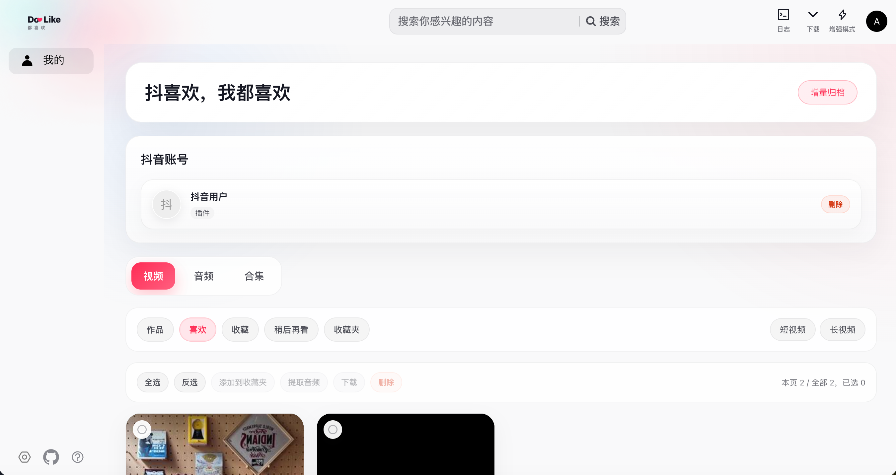
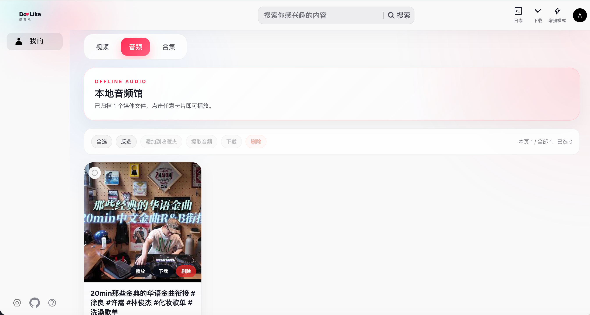

# DoLike

<p align="center">
  <strong>抖喜欢-全都喜欢 — 你的抖音个人归档系统</strong>
</p>

<p align="center">
  将你抖音账号下喜欢，收藏的视频、音频保存到本地，离线浏览，永不丢失。
</p>


---

## ✨ 特性

- **📦 全量归档** — 一键备份个人作品、喜欢、收藏、合集等 8 类内容
- **🎵 音频提取** — 批量提取视频音频，本地播放，支持离线音频馆
- **🔄 增量同步** — 首次全量抓取，后续自动增量更新
- **🔍 离线浏览** — 全文搜索、分类筛选、长短视频过滤、本地播放
- **⚡ 批量操作** — 全选/反选、批量下载、批量收藏、批量删
- **🔐 三路登录** — 无头浏览器扫码 / 手动粘贴 Cookie / 浏览器扩展桥接
- **🌐 浏览器扩展** — Chrome MV3 扩展，抖音页面一键归档
- **📡 实时推送** — WebSocket 实时同步下载进度与归档状态

<p align="center">
  
</p>

## 🎵 音频模式

<p align="center">
  
</p>

独立的音频标签页，归档的音频统一管理，支持在线/离线播放。

## 🎯 定位

| ✅ 做什么 | ❌ 不做什么 |
|-----------|-------------|
| 个人备份 & 离线浏览 | 点赞 / 评论 / 关注 / 私信 |
| 本机运行，数据自主 | 共享部署 / 云端同步 |
| 归档自己可见的内容 | 抓取他人或公开内容 |

> 所有服务默认仅监听 `127.0.0.1`，数据完全在本地。

## 🛠 技术栈

| 层级 | 技术 |
|------|------|
| 后端 | Node.js 20+ / TypeScript (ESM) |
| 框架 | Fastify 4.x (HTTP + WebSocket + Range) |
| 数据库 | SQLite (WAL + FTS5 全文搜索) |
| ORM | Prisma 5.x |
| 无头浏览器 | CloakBrowser + Playwright |
| 前端 | Vue 3 + Vite (pnpm monorepo) |
| 视频播放 | xgplayer (Range 流式播放) |
| 扩展 | Chrome MV3 |
| 媒体处理 | fluent-ffmpeg (音频提取) |

## 📁 项目结构

```
DoLike/
├── server/              # 后端服务 (Fastify + Prisma + SQLite)
├── web/                 # 前端工作区 (Vue 3 monorepo)
│   └── packages/
│       ├── dolike-portal/    # 主前端
│       ├── dolike-admin/     # 管理后台
│       └── dolike-creator/   # 创作者端
├── extension/           # Chrome MV3 浏览器扩展
├── docs/                # 项目文档 & 配图
├── docker-compose.yml   # Docker 编排
└── README.md
```

## 🚀 快速开始

### 环境要求

- **Node.js** >= 20 LTS
- **pnpm** >= 9.x (`corepack enable`)
- **Chrome/Edge** (用于安装扩展)

### 1️⃣ 启动后端

```bash
cd server
pnpm install
pnpm prisma:generate
pnpm prisma:migrate
pnpm dev
```

默认地址：`http://127.0.0.1:7777`

### 2️⃣ 启动前端

```bash
cd web
pnpm install
pnpm portal
```

### 3️⃣ 加载浏览器扩展（可选）

1. 打开 `chrome://extensions/`
2. 开启「开发者模式」
3. 「加载已解压的扩展程序」→ 选择 `extension/` 目录
4. 配置后端 URL：`http://127.0.0.1:7777`

详见 [extension/README.md](./extension/README.md)

### 4️⃣ 开始归档

1. 打开前端页面，注册并登录本地账号
2. 接入抖音账号（扫码 / Cookie / 扩展 三选一）
3. 点击「增量归档」，坐等完成 ✅

## ⚙️ 配置

| 环境变量 | 默认值 | 说明 |
|----------|--------|------|
| `PORT` | `7777` | 后端端口 |
| `DATABASE_URL` | `file:./dev.db` | 数据库连接串 |
| `ARCHIVE_ROOT` | `~/.dolike-archive` | 数据存储目录 |
| `LOG_LEVEL` | `info` | 日志级别 |

完整配置见 [server/.env.example](./server/.env.example)

## 🐳 Docker 部署

```bash
docker compose up -d
```

数据卷挂载到 `./data`，详见 [docs/DEPLOYMENT.md](./docs/DEPLOYMENT.md)

## 📚 文档

| 文档 | 说明 |
|------|------|
| [PRD](docs/PRD.md) | 产品需求文档 |
| [Backend Architecture](docs/Backend-Architecture.md) | 后端架构设计 |
| [Development Guide](docs/DEVELOPMENT.md) | 开发环境搭建 |
| [Deployment](docs/DEPLOYMENT.md) | 部署方案 |
| [Roadmap](docs/ROADMAP.md) | 功能路线图 |
| [FAQ](docs/FAQ.md) | 常见问题 |

## 🔒 安全

- Cookie 经 `aes-256-gcm` 加密存储，不明文落盘
- 密码使用 `argon2id` 哈希
- 所有服务仅绑定 `127.0.0.1`
- 不进行任何写操作（点赞/评论/私信）

## 📄 License

[MIT](LICENSE)
